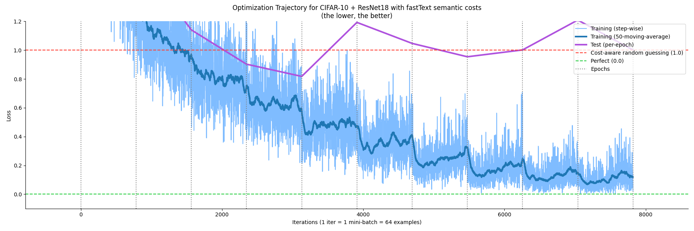
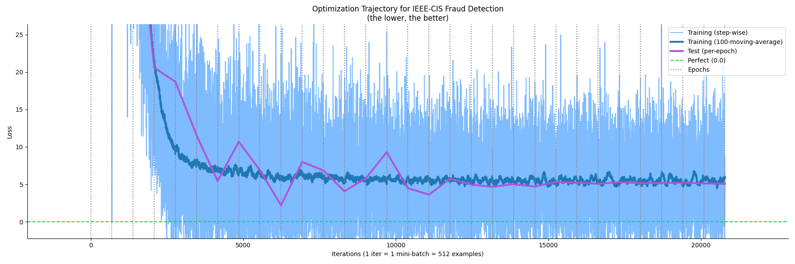

# CACIS — Cost-Aware Classification with Informative Selection

[](https://opensource.org/licenses/BSD-3-Clause)
[](https://www.python.org/downloads/)
[](https://pytorch.org/)

**CACIS** est un framework open source de **classification décisionnelle** (théorie de la décision) avec des **coûts de mauvaise classification dépendant de l’exemple**, exprimés en unités du monde réel (euros, énergie, temps, risque).

> **La précision n’est pas l’objectif — ce sont les décisions et leurs coûts.**

---

## 💡 Motivation

Dans les systèmes d’IA du monde réel (santé, finance, robotique) :
- **Les coûts de mauvaise classification varient selon l’exemple** : un faux négatif sur une maladie rare coûte plus cher qu’un faux négatif sur un simple rhume.
- **Les coûts sont dynamiques** : ils peuvent n’être connus qu’au moment de la décision (p. ex. prix de marché).
- **L’accuracy n’est qu’un proxy** : les métriques standards capturent mal l’impact business ou sécurité d’une décision.

Les pertes standard comme l’entropie croisée (Cross-Entropy) supposent des coûts uniformes. CACIS fournit une alternative de principe, dérivée du **transport optimal** et des **pertes de Fenchel–Young**.

---

## 🧠 Fondations scientifiques

CACIS s’appuie sur la théorie de [*Geometric Losses for Distributional Learning*](https://arxiv.org/abs/1905.06005). Il exploite le transport optimal entropique (Sinkhorn) pour « façonner » le simplexe des probabilités selon la géométrie des coûts.

En régularisant l’apprentissage avec une négentropie de Sinkhorn sensible aux coûts, CACIS garantit que le modèle apprend une distribution naturellement « tordue » vers des décisions coût-efficaces.

Vous pouvez lire les détails mathématiques de CACIS dans le fichier [math.md](math.md).

---

## 🚀 Démarrage rapide

### Installation

Veuillez d’abord lire les [instructions d’installation conda](https://harchaoui.org/warith/4ml)

```bash
# Cloner le dépôt
git clone https://github.com/warith-harchaoui/cacis.git
cd cacis

# Installer le package
pip install -e .
```

### Utilisation de base

```python
import torch
from cacis import CACISLoss

# Scores du modèle (B, K)
logits = torch.randn(8, 10, requires_grad=True)
# Labels de vérité terrain (B,)
labels = torch.randint(0, 10, (8,))
# Matrices de coûts dépendantes de l’exemple (B, K, K)
costs = torch.rand(8, 10, 10)

criterion = CACISLoss()
# Renvoie (raw_loss, normalized_loss, is_normalized)
output = criterion(logits, labels, C=costs)
loss = output.loss
loss.backward()
```

---

## 🪩 Démos mises en avant

### 1. ResNet sur CIFAR-10 (coûts sémantiques)

Nous utilisons des embeddings sémantiques **fastText** pour définir des coûts sur CIFAR-10. Cette démo montre comment les erreurs entre classes « proches » (p. ex. *Chat* vs *Chien*) sont moins pénalisées que les erreurs entre classes « éloignées » (p. ex. *Chat* vs *Camion*), grâce aux similarités sémantiques fastText.

```bash
# Exécution standard
python image_classification.py

# Exécution avec reporting CACIS normalisé (plus lent) pour une meilleure interprétation
python image_classification.py --normalization
```



### 2. Détection de fraude IEEE-CIS (coûts économiques)

Une démo tabulaire sur le dataset Kaggle *IEEE-CIS Fraud Detection*, où les coûts sont directement proportionnels aux montants des transactions.

Télécharger le dataset Kaggle IEEE-CIS Fraud Detection :
```bash
mkdir ieee-fraud-detection
wget -c http://deraison.ai/ai/ieee-fraud-detection.zip
unzip ieee-fraud-detection.zip -d ieee-fraud-detection
```

Utilisation :
```bash
python fraud_detection.py
```



---

## 📂 Structure du projet

```text
cacis/
├── cacis/                  # Package principal
│   ├── nn/                 # Sous-modules réseaux de neurones
│   │   └── __init__.py
│   ├── loss.py             # Implémentation de CACISLoss
│   ├── utils.py            # Utilitaires partagés (logging, devices, plotting)
│   └── __init__.py         # API publique (CACISLoss, utils)
├── image_classification.py # Démo de classification d’images
├── fraud_detection.py      # Démo de détection de fraude
├── tests/                  # Tests unitaires
├── math.md                 # Dérivations mathématiques (approfondissement)
├── setup.py                # Configuration du package
└── requirements.txt        # Dépendances
```

---

## 🗺️ Feuille de route

- [x] Formulation mathématique & dérivation Fenchel–Young
- [x] Implémentation PyTorch de `CACISLoss`
- [x] Exemples d’entraînement complets (CIFAR-10 / fastText)
- [ ] `CACISClassifier` compatible scikit-learn
- [ ] Incertitude conforme sensible aux coûts
- [ ] Package installable via pip sur PyPI
- [ ] Rapport technique / livre blanc

---

## 📚 Références

Si vous utilisez CACIS dans vos travaux, merci de citer :

> Arthur Mensch, Mathieu Blondel, Gabriel Peyré. **Geometric Losses for Distributional Learning**. *arXiv preprint arXiv:1905.06005*, 2019. [[Paper]](https://arxiv.org/abs/1905.06005)

```bibtex
@article{mensch2019geometric,
  title={Geometric Losses for Distributional Learning},
  author={Mensch, Arthur and Blondel, Mathieu and Peyr{\'e}, Gabriel},
  journal={arXiv preprint arXiv:1905.06005},
  year={2019}
}
```

---

## ⚖️ Licence

Licence BSD 3-Clause. Voir [LICENSE](LICENSE) pour plus de détails.
